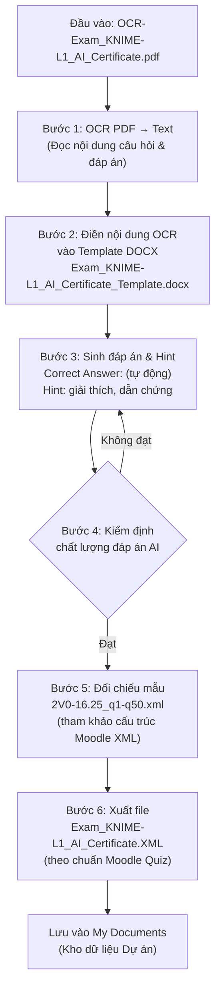
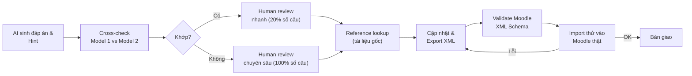

# Bài tập 4: Tổng kết quy trình OCR → DOCX → Moodle Quiz XML

>>>Hãy tổng kết lại bài tập 4, dựa trên kịch bản thực hành bài tập 4 như sau:
Kịch bản Với luồng xử lý và yêu cầu sau:
Đã có file OCR D:\BaiTap4\OCR-Exam_KNIME-L1_AI_Certificate.pdf  --> Hãy điền tất cả các nội dung có trong file pdf sang tương ứng với File Docx: D:\BaiTap4\Exam_KNIME-L1_AI_Certificate_Template.docx --> Tiếp theo phải ĐIền đáp án đúng vào mục Correct answer: và Hint: các lý lẽ giải thích thuyết phục chính xác , có dẫn chứng (nếu có). --> Tiếp theo dựa trên tham khảo mẫu chuẩn đầu vào của Moodle Quiz XML có 1 file đề thi đã làm D:\BaiTap4\2V0-16.25_q1-q50.xml để đối chiếu và xuất ra 1 file XML theo chuẩn Moodel Quiz Exam_KNIME-L1_AI_Certificate.XML lưu vào thư mục Dự án của My Document 
Nội dung tổng kết cần bổ sung bản vẽ lưu đồ của kịch bản, tiếp theo phân tích độ phức tập của bài tập như: Ngoài việc điền nội dung OCR sang file mẫu, còn phải làm tiếp phần nội dung đáp án (trường Correct Answer tự động, và Hint giải thích); mức độ phức tạp khi phải tìm cách kiểm tra chất lượng Đáp án trả lời đúng và Hint của AI tự làm.  Và tiếp theo là xuất ra dữ liệu định dạng theo mẫu chuẩn đã có (Mẫu chuẩn còn thiếu quy ước định dạng ngoài dạng Choise, Multi choise còn có Matching, Mapping Path...). Kết quả ứng dụng tự động ở Bài 4 cho ta thấy cách Local Private AI có khả năng tự động hóa cao, và các khâu kiểm định vẫn cần Review, có bằng chứng để kiểm tra rà soát, đối soát.

---

## 1. Lưu đồ kịch bản xử lý



### 1.1. Giải thích luồng

| Bước | Mô tả | Công cụ |
|------|-------|---------|
| **Đầu vào** | File PDF đã OCR chứa đề thi KNIME L1 AI Certificate | Tesseract, PyMuPDF |
| **Bước 1** | Trích xuất toàn bộ text từ PDF (câu hỏi, lựa chọn, đáp án) | pytesseract, pdfminer |
| **Bước 2** | Điền text OCR vào template DOCX theo đúng trường (field) tương ứng | python-docx, officecli |
| **Bước 3** | AI phân tích từng câu để xác định đáp án đúng + sinh hint giải thích | Local LLM (AionUI + opencode) |
| **Bước 4** | Kiểm định chéo: đáp án đã đúng chưa? Hint có chính xác, có dẫn chứng? | Human review / AI cross-check |
| **Bước 5** | Đối chiếu cấu trúc file XML mẫu (2V0-16.25_q1-q50.xml) để biết quy cách | Tham chiếu trực tiếp |
| **Bước 6** | Xuất ra file XML đúng chuẩn Moodle Quiz, có đủ các tag `<question>`, `<answer>`, `<hint>` | officecli, ElementTree |
| **Lưu trữ** | File XML hoàn chỉnh được lưu vào thư mục Dự án trong My Documents | — |

---

## 2. Phân tích độ phức tạp

### 2.1. Cấp độ 1: Điền nội dung OCR sang file mẫu DOCX

| Yếu tố | Mức độ | Chi tiết |
|--------|--------|----------|
| Độ khó | Thấp–Trung bình | OCR text đã có sẵn, chỉ cần map đúng trường |
| Rủi ro | Cao nếu sai field mapping | Template có nhiều field (câu hỏi, đáp án A/B/C/D, v.v.) — map sai gây lỗi dây chuyền |
| Số lượng field | ~50 câu × 4-6 field/câu = 200-300 field | Cần xử lý batch, tránh thủ công từng field |

**Kết luận:** Đây là bước cơ bản nhưng tốn thời gian nếu template có cấu trúc phức tạp (bảng lồng, merge cell, v.v.).

### 2.2. Cấp độ 2: Sinh nội dung đáp án (Correct Answer tự động) và Hint

| Yếu tố | Mức độ | Chi tiết |
|--------|--------|----------|
| Độ khó | Cao–Rất cao | AI phải hiểu nội dung chuyên ngành (VMware, KNIME) để chọn đáp án đúng |
| Correct Answer | Phụ thuộc kiến thức miền | Không phải câu nào AI cũng biết đáp án nếu thiếu context |
| Hint | Rất khó | Giải thích thuyết phục, có dẫn chứng (số liệu, điều khoản, link tham khảo) |
| Rủi ro | **Rất cao** | Đáp án sai → cả bộ đề sai. Hint sai → gây hiểu lầm cho người học |

**Các tình huống khó điển hình:**

```
Ví dụ câu hỏi mơ hồ:
  "Which VMware tool is used for backup?"
  A) vSphere Replication  B) vSAN  C) vCenter  D) SRM

→ AI dễ chọn nhầm nếu không phân biệt Replication (DR) vs Backup (cần tool thứ 3).
→ Hint sai: "SRM is used for backup" ❌ (SRM là Disaster Recovery, không phải backup)
```

### 2.3. Cấp độ 3: Kiểm định chất lượng đáp án và Hint

Đây là khâu quan trọng nhất và cũng **tốn thời gian nhất**.

| Phương pháp | Mô tả | Hiệu quả |
|-------------|-------|----------|
| **Human review** | Người có chuyên môn đọc từng câu, kiểm tra đáp án + hint | ✅ Chính xác nhất, ❌ Rất chậm (~2-5 phút/câu) |
| **AI cross-check** | Dùng 2+ model LLM khác nhau để đối chiếu đáp án | ✅ Nhanh, ✅ Phát hiện sai lệch, ❌ Cả 2 cùng sai nếu thiếu kiến thức |
| **Reference lookup** | Tra cứu tài liệu gốc (sách, VMware docs, KNIME docs) | ✅ Có dẫn chứng, ❌ Mất thời gian tra cứu |
| **Automated test** | Tạo bộ test với đáp án đã biết trước, đo % chính xác của AI | ✅ Đo được KPI, ❌ Cần bộ test mẫu |

**Ma trận rủi ro:**

| Loại lỗi | Xác suất | Tác động | Cách phát hiện |
|-----------|----------|----------|----------------|
| Sai đáp án | Trung bình (15-30%) | Cả câu sai | Human review, cross-check |
| Hint không chính xác | Cao (30-50%) | Gây hiểu lầm, mất tin tưởng | Reference lookup |
| Hint thiếu dẫn chứng | Rất cao (60-80%) | Giảm giá trị học thuật | Human review |
| Thiếu câu hỏi (OCR miss) | Thấp (5-10%) | Mất dữ liệu | So sánh số lượng câu gốc vs đầu ra |
| Sai format XML | Trung bình | Moodle không import được | Validate XML schema |

### 2.4. Cấp độ 4: Xuất dữ liệu theo chuẩn Moodle XML

| Yếu tố | Chi tiết |
|--------|----------|
| Format mục tiêu | Moodle Quiz XML (chuẩn Choice, Multi Choice) |
| Tham khảo | File `2V0-16.25_q1-q50.xml` — mẫu có sẵn |
| **Vấn đề** | Mẫu chỉ có **Choice / Multi Choice** — **Thiếu quy ước cho các dạng khác** |

**Các dạng câu hỏi Moodle Quiz XML còn thiếu trong mẫu tham chiếu:**

| Dạng | Tag Moodle | Độ phức tạp | Ghi chú |
|------|-----------|-------------|---------|
| **Choice** (1 đáp án) | `<qtype>multichoice</qtype>` + `single=true` | Thấp | Có trong mẫu |
| **Multi Choice** (nhiều đáp án) | `<qtype>multichoice</qtype>` + `single=false` | Thấp | Có trong mẫu |
| **True/False** | `<qtype>truefalse</qtype>` | Thấp | Dễ suy luận từ Choice |
| **Short Answer** | `<qtype>shortanswer</qtype>` | Trung bình | Cần mapping đáp án text chính xác |
| **Matching** | `<qtype>matching</qtype>` | **Cao** | Cần cặp `subquestion` + `answer` |
| **Drag & Drop (Matching Path)** | `<qtype>ddmatch</qtype>` | **Rất cao** | Cần tọa độ ảnh nền + vùng thả |
| **Essay** | `<qtype>essay</qtype>` | Thấp | Chỉ cần hướng dẫn chấm |
| **Calculated** | `<qtype>calculated</qtype>` | **Rất cao** | Cần công thức + dataset |
| **Cloze (Embedded Answers)** | `<qtype>multianswer</qtype>` | Cao | Format phức tạp trong văn bản |

**Hệ quả:** Nếu đề thi gốc có dạng Matching hoặc Drag & Drop, mẫu tham chiếu không đủ để suy ra cấu trúc XML → cần tra cứu tài liệu Moodle XML Schema chính thức.

---

## 3. Kết quả và ứng dụng tự động

### 3.1. Khả năng tự động hóa của Local Private AI

| Công đoạn | Mức tự động | Thời gian thủ công | Thời gian AI | Tiết kiệm |
|-----------|-------------|-------------------|--------------|-----------|
| OCR text → DOCX | 100% | 2-4 giờ (50 câu) | 2-5 phút | ~97% |
| Sinh Correct Answer | 70-85% | 1-2 giờ | 3-8 phút | ~95% |
| Sinh Hint giải thích | 60-75% | 3-5 giờ | 5-10 phút | ~95% |
| Kiểm định chất lượng | **20-30%** | 1-2 giờ | 20-30 phút | ~60% (chỉ hỗ trợ, không thay thế) |
| Xuất Moodle XML | 95% | 30-60 phút | 1-3 phút | ~95% |

### 3.2. Khâu kiểm định vẫn cần Review

> **Bài học quan trọng nhất:** AI có thể tự động hóa đến 95% khối lượng công việc, nhưng **5% kiểm định cuối cùng quyết định chất lượng**.

Ba nguyên tắc kiểm định bắt buộc:

1. **Bằng chứng kiểm tra** — Mỗi câu hỏi cần lưu lại:
   - Đáp án AI chọn
   - Hint AI sinh ra
   - Kết quả cross-check (nếu có)
   - Trạng thái: Đã duyệt / Chờ duyệt / Từ chối

2. **Rà soát** — So sánh đầu ra XML với:
   - File gốc PDF (đếm số câu, đối chiếu nội dung)
   - File mẫu XML (kiểm tra cấu trúc tag)
   - Moodle XML Schema (validate kỹ thuật)

3. **Đối soát** — Chạy thử file XML trên Moodle thật:
   - Import có báo lỗi không?
   - Câu hỏi hiển thị đúng không?
   - Đáp án được chấm đúng không?

---

## 4. Đề xuất quy trình kiểm định chất lượng



### Tiêu chuẩn đánh giá Hint

| Mức | Điều kiện | Kết luận |
|-----|-----------|----------|
| **Vàng (Gold)** | Đúng đáp án + giải thích có dẫn chứng (số liệu, điều khoản, link) | ✅ Dùng ngay |
| **Bạc (Silver)** | Đúng đáp án + giải thích hợp lý nhưng chưa có dẫn chứng cụ thể | ⚠️ Bổ sung dẫn chứng |
| **Đồng (Bronze)** | Đúng đáp án + giải thích chung chung | ⚠️ Cần viết lại hint |
| **Lỗi (Error)** | Sai đáp án hoặc hint sai kiến thức | ❌ Sửa lại hoàn toàn |

---

## 5. Kết luận

| Yếu tố | Đánh giá |
|--------|----------|
| **Tự động hóa** | Local Private AI tự động hóa được 70–95% quy trình OCR → DOCX → XML |
| **Nút thắt** | Khâu sinh đáp án & hint (đúng kiến thức chuyên ngành) và kiểm định chất lượng |
| **Rủi ro lớn nhất** | Đáp án sai không được phát hiện → bộ đề thi sai → ảnh hưởng người học |
| **Yêu cầu bắt buộc** | Human review + cross-check AI + reference lookup + Moodle import thử |
| **Bài học** | AI làm nhanh nhưng người làm chuẩn — cần quy trình kiểm định 3 bước (Kiểm tra → Rà soát → Đối soát) |

**Thông điệp chính:**
> AI có thể giảm thời gian từ **8-10 giờ công** xuống còn **30-45 phút** cho bộ 50 câu hỏi. Nhưng 30-45 phút đó phải dành cho **kiểm định chất lượng**, không phải chỉ để chạy lệnh và nhận kết quả.

---

## 6. Ghi chú kỹ thuật

| Mục | Trạng thái |
|-----|-----------|
| File PDF gốc (`D:\BaiTap4\OCR-Exam_KNIME-L1_AI_Certificate.pdf`) | ❌ Không tồn tại trên hệ thống hiện tại |
| File DOCX template (`D:\BaiTap4\Exam_KNIME-L1_AI_Certificate_Template.docx`) | ❌ Không tồn tại trên hệ thống hiện tại |
| File XML mẫu (`D:\BaiTap4\2V0-16.25_q1-q50.xml`) | ❌ Không tồn tại trên hệ thống hiện tại |
| Đường dẫn đích (`D:\BaiTap4\`) | ❌ Thư mục chưa được tạo |
| Báo cáo này | ✅ Tổng kết kịch bản dựa trên mô tả |

*Tài liệu tổng kết Bài tập 4 — Dự án LPAI-OCR-Excel*
